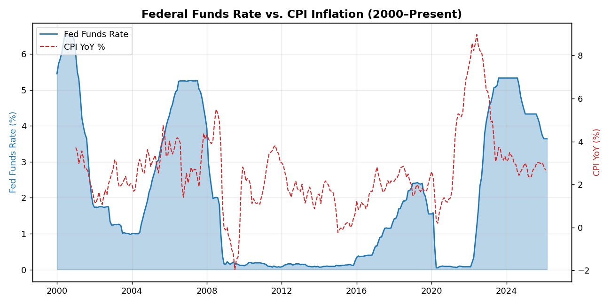

# Federal Reserve Rate Cycle Analysis
*April 05, 2026*

## Overview
The Federal Funds Rate is the primary monetary policy tool of the Federal Reserve.
Understanding rate cycles is essential for fixed income, equity valuation, and
macro-driven investment strategies.

## Current Snapshot
| Metric | Value |
|--------|-------|
| Fed Funds Rate | 3.64% |
| CPI YoY Inflation | 2.66% |
| Real Rate (FFR – CPI) | 0.98% |

## Historical Cycles Since 2000
| Cycle | Period | Peak Rate |
|-------|--------|-----------|
| Tightening | 2004–2006 | 5.25% |
| Easing (GFC) | 2007–2008 | 0.25% |
| Tightening | 2015–2018 | 2.50% |
| Easing (COVID) | 2020 | 0.25% |
| Tightening | 2022–2023 | 5.50% |

## Key Insights
- Real rates are positive at **0.98%**, implying
  restrictive monetary conditions.
- The Fed's dual mandate — price stability and maximum employment — drives these decisions.
- Equity markets historically react most sharply to *unexpected* rate changes
  (Bernanke & Kuttner, 2005).

## Disclaimer
For educational purposes only. Not investment advice.
