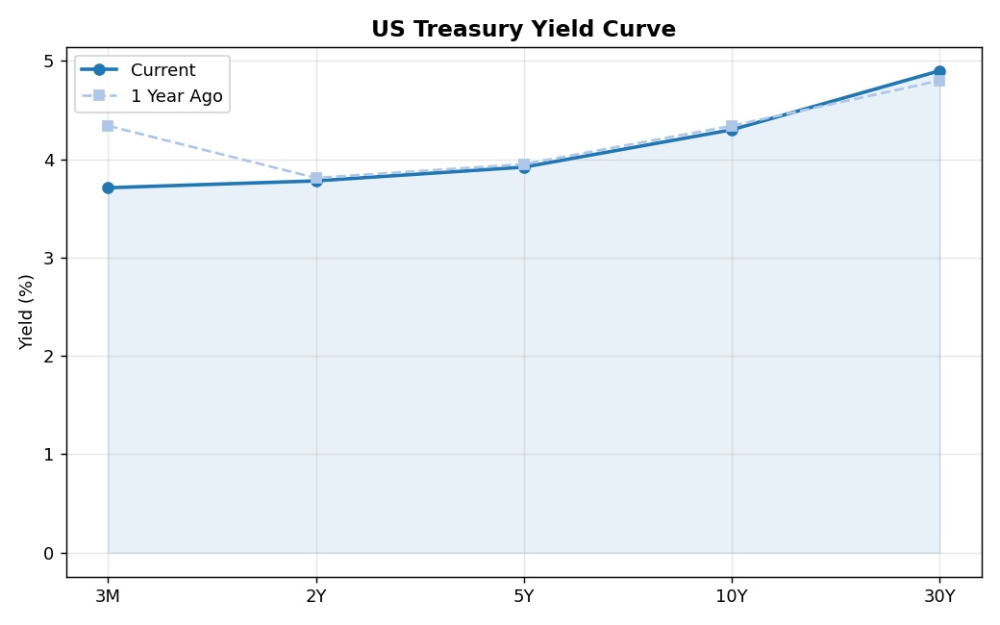

# US Treasury Yield Curve Analysis
*April 14, 2026*

## Overview
The yield curve plots Treasury yields across maturities. Its shape is one of the
most closely watched indicators in finance — inversions have preceded every US
recession since 1955.

## Current Yield Curve

| Maturity | Yield |
|----------|-------|
| 3M | 3.71% |
| 2Y | 3.78% |
| 5Y | 3.92% |
| 10Y | 4.30% |
| 30Y | 4.90% |

## Key Spread: 10Y – 2Y = +0.52%
✅ **Normal (upward-sloping) curve** — consistent with economic expansion expectations.

## Interpretation
- A **steep curve** implies the market expects strong growth and higher future rates.
- An **inverted curve** (short rates > long rates) suggests investors expect rate cuts
  ahead, often in response to a slowdown.
- The 10Y–2Y spread is the most cited recession indicator (Campbell & Shiller, 1991).

## Disclaimer
For educational purposes only. Not investment advice.
